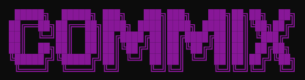
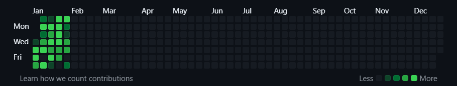
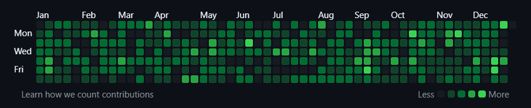
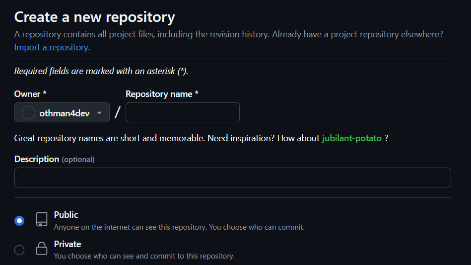
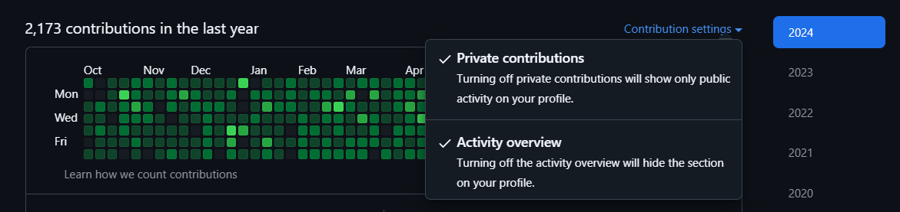

# COMMIX
### Commit Generator Tool



From This :



To This :



#### Read this README to get started with the Commit Generator Tool COMMIX !

## Overview

The **Commit Generator Tool** is a powerful utility designed to streamline the process of simulating commits in a Git repository. This package allows developers to create a realistic commit history, which can be useful for testing, demonstrations, or simply to give your profile a magnificent look.

## Features
- Generate a series of commits with random messages and file changes.
- Simulate various commit patterns to visualize commit history.
- Real commit message and project structure.

## Prerequisites

Before you begin, ensure you have the following installed:

- [Node.js](https://nodejs.org/) (version 12 or higher)
- [npm](https://www.npmjs.com/get-npm) (comes with Node.js)

## Installation

1. **Clone the Repository:**

   First, clone this repository to your local machine:

   ```bash
   git clone https://github.com/othman4dev/commix.git
   ```
### Create a New Repository:

Go to your GitHub account and create a new empty repository.



You can either create a public or private repository based on your preference.

if you create a private repository, you will need to set the Private contributions on which above the commit graph in your profile.



### Clone the Repository:
```
   git clone <your-repository-url>
```

### Copy Required Files:

Navigate to commix directory and copy the following files into your newly created repository's directory:

- run.js
- package.json

### Install Dependencies:

Open a terminal in your new repository and run:
   
```npm
   npm install
```
### Run the Commit Generator:

#### Finally, execute the following command to start generating commits:
   
```npm
   npm run commix
```

#### If you find any issue here, try deleting the node_modules folder and package-lock.json file and copy the ones in this repository to them (it might take a while).

## Usage
This tool will generate commits based on predefined parameters. You can customize the number of commits and other settings in the run.js file.

Contributing
We welcome contributions to enhance this tool. If you'd like to contribute, please fork the repository and submit a pull request.

License
This project is licensed under the MIT License - see the LICENSE file for details.

Acknowledgments
Thanks to the open-source community for their invaluable contributions.
Support
If you encounter any issues or have questions, feel free to open an issue on the repository.

This README serves as a comprehensive guide to getting started with the Commit Generator Tool COMMIX. Make sure to replace the placeholder paths for repository and update any relevant sections as necessary.

### [Othman Kharbouch](otmankharbouch.live), 2024. All rights reserved.

```
     █████╗  █████╗ ███╗   ███╗███╗   ███╗██╗██╗  ██╗
    ██╔══██╗██╔══██╗████╗ ████║████╗ ████║██║╚██╗██╔╝
    ██║  ╚═╝██║  ██║██╔████╔██║██╔████╔██║██║ ╚███╔╝ 
    ██║  ██╗██║  ██║██║╚██╔╝██║██║╚██╔╝██║██║ ██╔██╗ 
    ╚█████╔╝╚█████╔╝██║ ╚═╝ ██║██║ ╚═╝ ██║██║██╔╝╚██╗
     ╚════╝  ╚════╝ ╚═╝     ╚═╝╚═╝     ╚═╝╚═╝╚═╝  ╚═╝
```